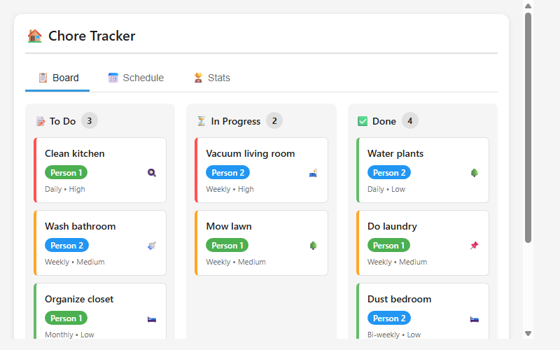
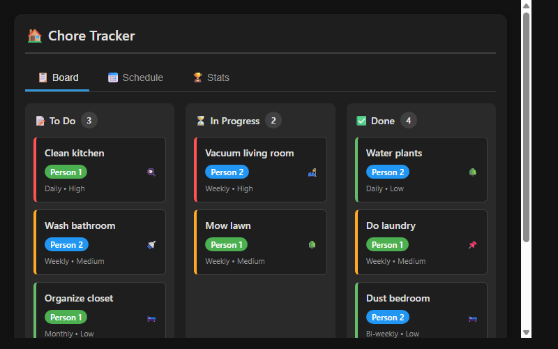

# Home Assistant Chore Tracker

[](https://github.com/MacSiem/ha-chore-tracker/actions/workflows/validate.yml)
[](https://github.com/hacs/integration)

A Lovelace card for Home Assistant that helps manage household chores with a kanban board, weekly schedule view, and member statistics.



## Features

- Kanban board with To Do, In Progress, and Done columns
- Quick chore creation with assignee, room, frequency, and priority
- Weekly schedule view for chore planning
- Statistics dashboard with completion rates and leaderboards
- Member streaks and completion tracking
- Light and dark theme support
- Emoji indicators for rooms and priorities
- Drag-and-drop chore management

## Installation

### HACS (Recommended)

1. Open HACS in your Home Assistant
2. Go to Frontend → Explore & Download Repositories
3. Search for "Chore Tracker"
4. Click Download

### Manual

1. Download `ha-chore-tracker.js` from the [latest release](https://github.com/MacSiem/ha-chore-tracker/releases/latest)
2. Copy it to `/config/www/ha-chore-tracker.js`
3. Add the resource in Settings → Dashboards → Resources:
   - URL: `/local/ha-chore-tracker.js`
   - Type: JavaScript Module

## Usage

Add the card to your dashboard:

```yaml
type: custom:ha-chore-tracker
title: Chore Tracker
members:
  - name: Person 1
    color: '#4CAF50'
  - name: Person 2
    color: '#2196F3'
```

### Configuration

| Option | Type | Default | Description |
|--------|------|---------|-------------|
| `type` | string | `custom:ha-chore-tracker` | Card type |
| `title` | string | `Chore Tracker` | Card title |
| `members` | array | See default config | List of household members with colors |
| `members[].name` | string | `Person 1` | Member name |
| `members[].color` | string | `#4CAF50` | Member color for assignee badges |

## Screenshots

| Light Theme | Dark Theme |
|:-----------:|:----------:|
|  |  |

## How It Works

The Chore Tracker provides three main views:

**Board View** displays chores in a kanban-style board with three columns:
- To Do: New chores waiting to be started
- In Progress: Chores currently being worked on
- Done: Completed chores with tracking

Each chore shows the assignee, room/area, frequency, and priority. Use the action buttons to move chores between columns or delete them.

**Schedule View** shows a weekly calendar of chores organized by day and frequency, helping plan who does what and when.

**Stats View** displays completion statistics, member leaderboards with streaks, and overall household productivity metrics.

## License

MIT License - see [LICENSE](LICENSE) file.
